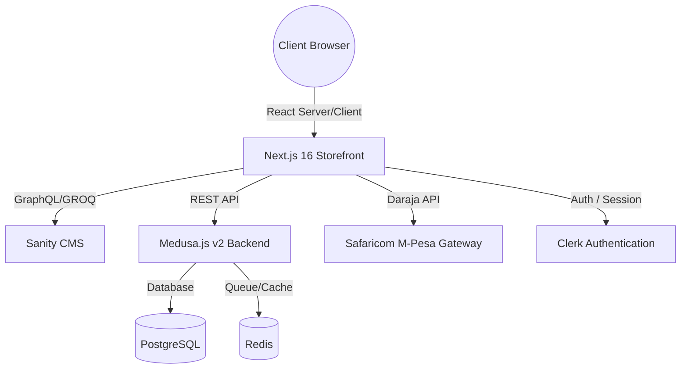

# LUMI Lighting. E-Commerce Platform

A premium, production-ready e-commerce and CMS ecosystem designed for **LUMI Lighting.**, a luxury lighting retailer specializing in LED Bulbs, LED Panels, Chandeliers, Floodlights, Switches, Sockets, and accessories.

---

## 🛠️ Technology Stack & Architecture

The architecture consists of a decouple-first storefront communicating with an e-commerce microservices backend and content management system (CMS):



### 1. Storefront (Next.js 16 App Router)

- **Framework**: Next.js 16 (App Router) & TypeScript
- **Styling**: Tailwind CSS & ShadCN UI
- **Auth**: Clerk (Social Login, Magic Links, Secure Customer Profile)
- **CMS Client**: Next-Sanity (GROQ queries for Hero banners, blogs, FAQs, company content)
- **State/Val**: React Hook Form & Zod Validation

### 2. E-Commerce Backend (Medusa.js v2)

- **Engine**: Medusa.js v2 (Core Commerce Engine, Inventory Management, Product Variants, Orders API, Discounts)
- **Cache**: Redis Cache & PubSub
- **Database**: PostgreSQL

### 3. Payments & Integrations

- **M-Pesa Daraja API**: STK Push (Lipa Na M-Pesa Online v1) with asynchronous status callbacks.
- **WhatsApp Integration**: "Buy via WhatsApp" triggers dynamic pre-filled text chat links.
- **Room Lighting Calculator**: Internal engine evaluating dimensions to suggest exact LED Wattage and Panel quantities.

---

## 📂 Project Structure

```
lumilightingco/
├── app/                        # Next.js App Router Page Tree
│   ├── api/
│   │   ├── mpesa/
│   │   │   ├── stkpush/        # Triggers M-Pesa STK Push
│   │   │   └── callback/       # Safaricom Daraja Webhook
│   │   └── quote/              # Contractor quotation submission
│   ├── calculator/             # Dedicated Calculator Page
│   ├── shop/                   # Products catalog with filters
│   ├── product/                # Product details with specs & WhatsApp
│   ├── cart/                   # Shopping Cart page
│   ├── checkout/               # Checkout payment routing
│   └── dashboard/              # Clerk-secured Customer dashboard
├── components/                 # UI Blocks & Showroom elements
│   ├── calculator/             # LightingCalculator component
│   ├── shop/                   # ProductCard, ShopFilters, ProductGrid
│   ├── cart/                   # CartDrawer slide-over
│   └── layout/                 # Navbar, Footer
├── lib/                        # Integrations services
│   ├── medusa.ts               # Medusa v2 Store Client
│   ├── sanity.ts               # GROQ queries client
│   └── mpesa.ts                # M-Pesa Daraja STK Push SDK
├── sanity/                     # Sanity CMS Configuration
│   ├── schemaTypes/            # Schemas (hero, blog, testimonial, faq, about)
│   └── env.ts
├── Dockerfile                  # Multi-stage production container setup
└── package.json
```

---

## 🔑 Environment Variables Documentation

Create a `.env.local` inside the `lumilightingco/` folder:

```env
# Clerk Authentication
NEXT_PUBLIC_CLERK_PUBLISHABLE_KEY=your_clerk_publishable_key
CLERK_SECRET_KEY=your_clerk_secret_key
NEXT_PUBLIC_CLERK_SIGN_IN_URL=/sign-in
NEXT_PUBLIC_CLERK_SIGN_UP_URL=/sign-up
NEXT_PUBLIC_CLERK_SIGN_IN_FALLBACK_REDIRECT_URL=/
NEXT_PUBLIC_CLERK_SIGN_UP_FALLBACK_REDIRECT_URL=/

# Sanity CMS
NEXT_PUBLIC_SANITY_PROJECT_ID=your_sanity_project_id
NEXT_PUBLIC_SANITY_DATASET=production
NEXT_PUBLIC_SANITY_API_VERSION=2026-06-09

# Medusa v2
NEXT_PUBLIC_MEDUSA_BACKEND_URL=http://localhost:9000
NEXT_PUBLIC_MEDUSA_PUBLISHABLE_KEY=your_medusa_publishable_key

# Safaricom M-Pesa Daraja
MPESA_ENVIRONMENT=sandbox # Set to 'production' for live payments
MPESA_CONSUMER_KEY=your_daraja_consumer_key
MPESA_CONSUMER_SECRET=your_daraja_consumer_secret
MPESA_SHORTCODE=174379 # Default sandbox Paybill/Till number
MPESA_PASSKEY=your_daraja_stk_passkey
MPESA_CALLBACK_URL=https://your-public-tunnel.ngrok-free.app/api/mpesa/callback
```

---

## 🚀 Local Installation & Setup

### 1. Prerequisite Installations

Ensure you have Node.js (>=20) and `pnpm` installed globally:

```bash
npm install -g pnpm
```

### 2. Backend Orchestration (Medusa v2)

In the monorepo root (`lumilightingco-medusa`), start PostgreSQL, Redis, and Medusa backend via Docker:

```bash
pnpm run docker:up
```

### 3. Front-End Storefront Installation

Navigate to the storefront folder, install dependencies, and start the development server:

```bash
cd lumilightingco
pnpm install
pnpm run dev
```

Open [http://localhost:3000](http://localhost:3000) in your browser.

### 4. Sanity Studio Content Setup

Run the Sanity studio locally to manage Hero banners, testimonials, blogs, and FAQs:

```bash
pnpm exec sanity dev
```

Access the dashboard at [http://localhost:3333](http://localhost:3333).

---

## ⚡ M-Pesa STK Push Flow & Tunneling

Safaricom needs a publicly exposed callback URL to notify the Next.js server of transaction results. For local testing:

1. Start an Ngrok tunnel:
   ```bash
   ngrok http 3000
   ```
2. Copy the HTTPS forwarding address (e.g. `https://abcd-123.ngrok-free.app`).
3. Set the `MPESA_CALLBACK_URL` variable in your `.env.local` to:
   ```env
   MPESA_CALLBACK_URL=https://abcd-123.ngrok-free.app/api/mpesa/callback
   ```
   When triggering payment in the checkout:

- Customer selects **M-Pesa** and enters their phone number.
- The route `/api/mpesa/stkpush` fetches Safaricom token and triggers the prompt.
- The phone receives the prompt -> Customer inputs PIN.
- Safaricom POSTs callback details to `/api/mpesa/callback`.
- The webhook logs the transaction status and registers the payment receipt.
